# How to Make Claude Code Remember Everything

**A complete guide to building layered memory for Claude Code — daily logs, session state, cross-session awareness, project knowledge, and secret-safe logging. No databases, no background processes, just bash scripts and markdown files.**

---

## The Problem

Claude Code has no long-term memory. Every session starts blank. Context compaction can erase your working state mid-session. Multiple concurrent sessions on the same repo have zero awareness of each other.

Some third-party tools tackle this with SQLite databases, background worker services, and structured observation capture on every tool call. Those approaches are powerful — but heavy. Everything in this guide uses bash scripts, markdown files, and Claude Code's built-in hook system.

Here's the full architecture, built up layer by layer.



---

## Layer 1: Daily Prompt Logging

> **Token cost:** 0 at write time. Loaded in Layer 2.

**What it does:** Automatically logs every prompt you send to Claude, creating a searchable daily journal of everything you worked on.

**Why it matters:** When you start a session tomorrow, Claude can see what you were doing today and yesterday. No manual notes needed.



### How It Works

A `UserPromptSubmit` hook fires on every prompt. It extracts the text, sanitizes secrets, and appends it to a daily markdown file with a timestamp.

### Setup

**Step 1: Create the log directory**

```bash
mkdir -p ~/.claude/logs
```

**Step 2: Create the logging hook**

Create `~/.claude/hooks/log-prompt.sh`:

```bash
#!/bin/bash
# Hook: UserPromptSubmit
# Appends each user prompt to a daily log file with timestamp.

INPUT=$(cat)
PROMPT=$(echo "$INPUT" | jq -r '.prompt // empty' 2>/dev/null)

# Skip empty prompts and slash commands
if [ -z "$PROMPT" ] || [[ "$PROMPT" == /* ]]; then
  exit 0
fi

DATE=$(date +%Y-%m-%d)
TIME=$(date +%H:%M)
LOG_DIR="$HOME/.claude/logs"
LOG_FILE="$LOG_DIR/$DATE.md"

mkdir -p "$LOG_DIR"

# Create header if new file
if [ ! -f "$LOG_FILE" ]; then
  echo "# Daily Log — $DATE" > "$LOG_FILE"
fi

# Truncate long prompts for readability
TRUNCATED=$(echo "$PROMPT" | head -c 1000)
if [ ${#PROMPT} -gt 1000 ]; then
  TRUNCATED="${TRUNCATED}..."
fi

# Sanitize secrets before writing (see Layer 5)
SANITIZER="$HOME/.claude/scripts/sanitize-log.sh"
if [ -x "$SANITIZER" ]; then
  TRUNCATED=$(printf '%s' "$TRUNCATED" | "$SANITIZER")
fi

echo "" >> "$LOG_FILE"
echo "**$TIME** — $TRUNCATED" >> "$LOG_FILE"

exit 0
```

```bash
chmod +x ~/.claude/hooks/log-prompt.sh
```

**Step 3: Register the hook** in `~/.claude/settings.json`:

```json
{
  "hooks": {
    "UserPromptSubmit": [
      {
        "matcher": "",
        "hooks": [
          {
            "type": "command",
            "command": "$HOME/.claude/hooks/log-prompt.sh",
            "timeout": 5
          }
        ]
      }
    ]
  }
}
```

### What You Get

Daily files like `~/.claude/logs/2026-02-16.md`:

```markdown
# Daily Log — 2026-02-16

**08:49** — Hey, I didn't get my morning briefing

**10:18** — What are the trade-offs in going with MySQL over our current storage

**10:48** — Find my open project to-do items and lets spin up processes...
```

These accumulate automatically. No action required after setup.

---

## Layer 2: Session History Loading

> **Token cost:** ~2,500 tokens (light usage, ~20 prompts/day) to ~25,000 tokens (heavy usage, 100+ prompts/day). This is the most expensive layer — it loads 2 full days of logs. See [Tuning Token Budget](#tuning-the-token-budget) for ways to cap it.

**What it does:** On every session start, injects the last 2 days of daily logs into Claude's context.

**Why it matters:** Claude immediately knows what you were working on recently without you re-explaining anything.

### Setup

Create `~/.claude/hooks/load-history.sh`:

```bash
#!/bin/bash
# Hook: SessionStart
# Loads the last 2 days of daily logs into Claude's context,
# then loads session state files for compaction recovery and peer awareness.

# Read hook input from stdin
INPUT=$(cat)
SESSION_ID=$(echo "$INPUT" | jq -r '.session_id // empty' 2>/dev/null)
CWD=$(echo "$INPUT" | jq -r '.cwd // empty' 2>/dev/null)
SOURCE=$(echo "$INPUT" | jq -r '.source // "startup"' 2>/dev/null)

LOG_DIR="$HOME/.claude/logs"

OUTPUT=""

# --- Daily Logs ---
if [ -d "$LOG_DIR" ]; then
  TODAY=$(date +%Y-%m-%d)
  YESTERDAY=$(date -d "yesterday" +%Y-%m-%d)

  if [ -f "$LOG_DIR/$YESTERDAY.md" ]; then
    OUTPUT+="$(cat "$LOG_DIR/$YESTERDAY.md")"
    OUTPUT+=$'\n\n---\n\n'
  fi

  if [ -f "$LOG_DIR/$TODAY.md" ]; then
    OUTPUT+="$(cat "$LOG_DIR/$TODAY.md")"
  fi
fi

if [ -n "$OUTPUT" ]; then
  echo "## Recent Session History"
  echo ""
  echo "$OUTPUT"
  echo ""
fi

# --- Session State (see Layer 3) ---
LOADER="$HOME/.claude/scripts/load-session-state.sh"
if [ -x "$LOADER" ] && [ -n "$SESSION_ID" ]; then
  "$LOADER" "$SESSION_ID" "$CWD" "$SOURCE"
fi

exit 0
```

```bash
chmod +x ~/.claude/hooks/load-history.sh
```

Register in `~/.claude/settings.json` (add to the `hooks` object):

```json
"SessionStart": [
  {
    "matcher": "",
    "hooks": [
      {
        "type": "command",
        "command": "$HOME/.claude/hooks/load-history.sh",
        "timeout": 5
      }
    ]
  }
]
```

> **Note:** The hook parses `session_id`, `cwd`, and `source` from stdin. The `source` field tells you how the session started: `"startup"` (new), `"resume"`, `"clear"` (after /clear), or `"compact"` (after auto-compaction). This becomes important in Layer 3.

### What You Get

Every time Claude starts, it immediately sees your recent work history. No manual action needed.

---

## Layer 3: Session State Persistence

> **Token cost:** ~200 tokens (own state) + ~150 tokens (3 peer summaries) = **~350 tokens** on startup. The cheapest layer relative to its value.

**What it does:** Claude periodically writes a small state summary to disk. On compaction, it recovers its own state. On new session start, it sees what other sessions are doing.

**Why it matters:** This is the big one. Context compaction no longer means amnesia. Multiple concurrent sessions on the same repo gain awareness of each other.



### The Design

```
~/.claude/sessions/
  my-app/
    abc123-session-id.md     # Session A's state
    def456-session-id.md     # Session B's state
  api-server/
    ghi789-session-id.md     # Different project, isolated
```

Each file is ~100-200 tokens of intent-focused markdown. No raw tool outputs, no observation databases. Just what Claude knows about what it's doing and why.



### Setup

**Step 1: Create the sessions directory**

```bash
mkdir -p ~/.claude/sessions
```

**Step 2: Create the loader script**

Create `~/.claude/scripts/load-session-state.sh`:

```bash
#!/bin/bash
# load-session-state.sh — Load session state files on SessionStart.
# Called from load-history.sh with three args:
#   $1 = SESSION_ID
#   $2 = CWD (current working directory)
#   $3 = SOURCE ("startup", "resume", "clear", or "compact")
#
# Behavior:
#   - Derives project name from CWD (basename of repo directory)
#   - If source=compact: loads only THIS session's state file (recovery)
#   - Otherwise: loads own file + up to 3 recent peer files (awareness)
#   - Cleans up files older than 48h
#   - Outputs markdown to stdout for hook injection

set -euo pipefail

SESSION_ID="${1:-}"
CWD="${2:-$PWD}"
SOURCE="${3:-startup}"

if [ -z "$SESSION_ID" ]; then
  exit 0
fi

# Derive project name: basename of CWD, or "home" for $HOME
if [ "$CWD" = "$HOME" ]; then
  PROJECT="home"
else
  PROJECT="$(basename "$CWD")"
fi

SESSION_DIR="$HOME/.claude/sessions/$PROJECT"
OWN_FILE="$SESSION_DIR/$SESSION_ID.md"

# Create project session dir if it doesn't exist
mkdir -p "$SESSION_DIR"

# Cleanup: delete files older than 48h
find "$SESSION_DIR" -name "*.md" -mmin +2880 -delete 2>/dev/null || true

# Collect output
OUTPUT=""

# Load own session file if it exists (compaction recovery)
if [ -f "$OWN_FILE" ]; then
  OUTPUT+="## Active Sessions ($PROJECT)"
  OUTPUT+=$'\n\n'
  OUTPUT+="### This Session (resuming)"
  OUTPUT+=$'\n'
  OUTPUT+="$(cat "$OWN_FILE")"
  OUTPUT+=$'\n\n'
fi

# If not compaction, also load recent peer sessions for awareness
if [ "$SOURCE" != "compact" ]; then
  # Get up to 3 most recent peer files (not our own)
  PEERS=$(find "$SESSION_DIR" -name "*.md" ! -name "$SESSION_ID.md" \
    -printf '%T@ %p\n' 2>/dev/null \
    | sort -rn \
    | head -3 \
    | awk '{print $2}')

  if [ -n "$PEERS" ]; then
    if [ -z "$OUTPUT" ]; then
      OUTPUT+="## Active Sessions ($PROJECT)"
      OUTPUT+=$'\n\n'
    fi
    OUTPUT+="### Recent Peer Sessions"
    OUTPUT+=$'\n'

    while IFS= read -r peer_file; do
      [ -z "$peer_file" ] && continue
      peer_id="$(basename "$peer_file" .md)"
      # Calculate age
      file_age_min=$(( ($(date +%s) - $(stat -c %Y "$peer_file")) / 60 ))
      if [ "$file_age_min" -lt 60 ]; then
        age_str="${file_age_min} min ago"
      else
        age_hours=$(( file_age_min / 60 ))
        age_str="${age_hours}h ago"
      fi
      # Extract first line of "What I'm Doing" section and branch
      doing=$(sed -n '/^## What I.*Doing/,/^##/{/^## What/d;/^##/d;/^$/d;p;}' \
        "$peer_file" | head -1)
      branch=$(grep -oP '(?<=\*\*Branch:\*\* ).*' "$peer_file" | head -1)
      OUTPUT+=$'\n'"**Session ${peer_id:0:7}** (${age_str}):"
      [ -n "$doing" ] && OUTPUT+=$'\n'"- $doing"
      [ -n "$branch" ] && OUTPUT+=$'\n'"- Branch: \`$branch\`"
      OUTPUT+=$'\n'
    done <<< "$PEERS"
  fi
fi

if [ -n "$OUTPUT" ]; then
  echo "$OUTPUT"
fi

exit 0
```

```bash
chmod +x ~/.claude/scripts/load-session-state.sh
```

**Step 3: Tell Claude to write state**

Add this to your `~/.claude/CLAUDE.md`:

```markdown
## Session State Persistence

Periodically write a session state summary to
`~/.claude/sessions/{project}/{sessionId}.md` where:
- `{project}` is the basename of the current working directory
  (e.g., `my-app`, `api-server`). If CWD is `$HOME`, use `home`.
- `{sessionId}` is your current session ID.

**When to write:**
- After completing a significant task or milestone
- Roughly every 15-20 tool calls during active work
- Before a long chain of subagent dispatches
- When you notice context is getting large

**What to write** (keep it ~100-200 tokens):

    # Session State
    **Project:** {project}
    **Branch:** {current branch}
    **Updated:** {YYYY-MM-DD HH:MM}

    ## What I'm Doing
    {1-2 sentences about the current task}

    ## Key Decisions
    {bullet list of important choices made this session}

    ## Files Touched
    {bullet list of key files modified}

    ## Blockers / Open
    {anything unresolved}

    ## Next
    {what comes after current work}

**Do NOT:**
- Write state on every tool call (too noisy)
- Include raw tool outputs or file contents
- Write state for trivial/short sessions (< 5 tool calls)
```

**Step 4: Verify it works**

Create a test file and run both scenarios:

```bash
# Create test data
mkdir -p ~/.claude/sessions/test-project
cat > ~/.claude/sessions/test-project/fake-aaa.md << 'EOF'
# Session State
**Project:** test-project
**Branch:** main
**Updated:** 2026-02-16 12:00

## What I'm Doing
Testing session state persistence.

## Key Decisions
- Using markdown files instead of a database
EOF

# Test compaction recovery (own session only)
echo '{"session_id":"fake-aaa","cwd":"/tmp/test-project","source":"compact"}' \
  | ~/.claude/hooks/load-history.sh 2>/dev/null \
  | grep -A 10 "Active Sessions"

# Test peer awareness (new session sees others)
echo '{"session_id":"brand-new","cwd":"/tmp/test-project","source":"startup"}' \
  | ~/.claude/hooks/load-history.sh 2>/dev/null \
  | grep -A 10 "Active Sessions"

# Clean up
rm -rf ~/.claude/sessions/test-project
```

### Multi-Session Isolation



Sessions on different projects never see each other's state. Sessions on the same project get a condensed peer view showing what others are working on and which branch they're on.

---

## Layer 4: Global Instructions (CLAUDE.md)

> **Token cost:** ~200–600 tokens depending on how much you put in it. Loaded by Claude Code automatically (not by our hooks).

**What it does:** Persistent instructions that load into every Claude session automatically.

**Why it matters:** Your preferences, workflow rules, and behavioral guidelines survive across all sessions without repetition.

### Setup

Create or edit `~/.claude/CLAUDE.md`:

```markdown
# Machine-Level Notes

## Session Continuity

When resuming work from a previous session, always check for
session summary files, recent git log, and TODO/plan files
before asking the user to re-explain context.

## Working Style

During brainstorming, freely offer alternative perspectives.
Once the user has chosen a direction, commit to it and build
on it — don't push back unless there's a critical blocker.

## Verify Assumptions Before Writing Code

Before implementing or testing, explicitly list assumptions
about how the system behaves — then write tests that validate
those assumptions first.
```

This file is automatically loaded by Claude Code on every session start. No hook needed — it's a built-in feature.

### Scope Levels

Claude Code loads instructions from multiple levels, merged together:

| File | Scope | Loaded When |
|------|-------|-------------|
| `~/.claude/CLAUDE.md` | Global (all projects) | Every session |
| `{project}/.claude/CLAUDE.md` | Project-specific | Sessions in that project |
| `{project}/CLAUDE.md` | Project root | Sessions in that project |

Use global for personal preferences and workflow rules. Use project-level for repo-specific conventions, tech stack details, and architectural decisions.

---

## Layer 5: Persistent Memory (MEMORY.md)

> **Token cost:** ~300–1,000 tokens. Truncated at 200 lines, so it has a natural ceiling. Loaded by Claude Code automatically.

**What it does:** Claude Code's auto-memory system — a file that Claude reads on every session and can update as it learns things about your setup.

**Why it matters:** Knowledge accumulates across sessions. Claude learns your environment, your tools, your preferences — and remembers them.

### Setup

The memory file lives at `~/.claude/projects/{project-path}/memory/MEMORY.md`. Claude Code manages the project path mapping automatically.

For global memory (loaded in all sessions from your home directory):

```
~/.claude/projects/-home-youruser/memory/MEMORY.md
```

For project-specific memory:

```
~/.claude/projects/-home-youruser-code-my-app/memory/MEMORY.md
```

> **Note:** The path uses dashes instead of slashes. `~/code/my-app` becomes `-home-youruser-code-my-app`.

### What To Store

```markdown
# Memory

## Environment
- **Platform**: Ubuntu 24.04
- **Node**: v22, managed by asdf

## User Preferences
- Prefers direct action over excessive planning
- Always use pnpm, never npm

## Project Notes
- API routes live in src/routes/api/
- Tests use vitest, run with `npx vitest run`
- Database migrations: src/db/migrations/
```

### What NOT To Store

- Session-specific context (that's what session state files are for)
- Anything that duplicates CLAUDE.md instructions
- Speculative conclusions from reading a single file
- Anything that changes frequently

Claude will update this file autonomously as it discovers stable patterns. You can also tell it directly: "remember that I always use bun instead of npm" and it will persist the preference.

---

## Layer 6: Secret Sanitization

> **Token cost:** 0. This is a preprocessing step — it runs before text is written to logs, not when context is loaded.

**What it does:** Automatically redacts API keys, tokens, and credentials from daily logs before they're written to disk.

**Why it matters:** Your daily logs are a goldmine of context — but if you paste a Discord token or API key into a prompt, you don't want it persisted in plain text.



### Setup

Create `~/.claude/scripts/sanitize-log.sh`:

```bash
#!/usr/bin/env bash
# sanitize-log.sh — Redacts secrets from text before writing to log files.
# Usage: echo "$text" | sanitize-log.sh
# Two-pronged approach:
#   1. Regex patterns for known secret formats
#   2. Exact value matching against a secrets cache (optional)

set -uo pipefail

INPUT=$(cat)

# --- Prong 1: Known patterns ---

# Discord bot tokens
INPUT=$(echo "$INPUT" | sed -E \
  's/[MN][A-Za-z0-9_-]{23,}\.[A-Za-z0-9_-]{6}\.[A-Za-z0-9_-]{27,}/[REDACTED:DISCORD_TOKEN]/g')

# OpenAI API keys
INPUT=$(echo "$INPUT" | sed -E \
  's/sk-[A-Za-z0-9_-]{20,}/[REDACTED:OPENAI_KEY]/g')

# Google/Gemini API keys
INPUT=$(echo "$INPUT" | sed -E \
  's/AIzaSy[A-Za-z0-9_-]{33}/[REDACTED:GOOGLE_KEY]/g')

# AWS access keys
INPUT=$(echo "$INPUT" | sed -E \
  's/AKIA[0-9A-Z]{16}/[REDACTED:AWS_KEY]/g')

# GitHub tokens (ghp_, gho_, ghu_, ghs_, ghr_)
INPUT=$(echo "$INPUT" | sed -E \
  's/gh[pousr]_[A-Za-z0-9_]{36,}/[REDACTED:GITHUB_TOKEN]/g')

# --- Prong 2: Exact value matching (optional) ---
# If you have a secrets binary that exports key=value pairs,
# uncomment and adapt this section:
#
# SECRETS_BIN="$HOME/.local/bin/secrets"
# if [[ -x "$SECRETS_BIN" ]]; then
#   while IFS='=' read -r key val; do
#     if [[ -n "$key" && -n "$val" && ${#val} -ge 8 ]]; then
#       escaped=$(printf '%s' "$val" | sed 's/[&/\]/\\&/g')
#       INPUT=$(echo "$INPUT" | sed "s|${escaped}|[REDACTED:${key}]|g")
#     fi
#   done < <("$SECRETS_BIN" values 2>/dev/null || true)
# fi

printf '%s' "$INPUT"
```

```bash
chmod +x ~/.claude/scripts/sanitize-log.sh
```

The log-prompt hook from Layer 1 already calls this script if it exists. No additional wiring needed.

### Adding Your Own Patterns

The regex approach catches common formats. For project-specific secrets, add patterns:

```bash
# Stripe keys
INPUT=$(echo "$INPUT" | sed -E \
  's/sk_live_[A-Za-z0-9]{24,}/[REDACTED:STRIPE_KEY]/g')

# Supabase keys
INPUT=$(echo "$INPUT" | sed -E \
  's/eyJ[A-Za-z0-9_-]{100,}/[REDACTED:JWT_TOKEN]/g')
```

---

## Layer 7: Manual Session Snapshots (/session-end)

> **Token cost:** 0 at startup. This writes a file on demand — it doesn't inject anything into session context automatically. The next session benefits indirectly if you read the file.

**What it does:** A user-invocable skill that writes a detailed session summary to the project root. Designed for end-of-day or end-of-task handoffs.

**Why it matters:** Layer 3 (session state) captures *working* state automatically. This captures *handoff* state intentionally — a richer, more considered summary for when you're done and want the next session to pick up cleanly.

### Setup

Create `~/.claude/skills/session-end/SKILL.md`:

```markdown
---
name: session-end
description: Save a summary of the current session so the next one can pick up
user_invocable: true
---

# Session End

Write a session state file at `.claude/SESSION_STATE.md` (relative to the
project root) that gives the next Claude session full context to resume
without asking the user to re-explain anything.

## Steps

1. **Review the session.** Look at what was discussed, what changed,
   and what's still open.
2. **Check git state.** Run `git diff --stat` and `git log --oneline -5`
   to capture the current branch and recent work.
3. **Write `.claude/SESSION_STATE.md`** with the format below.
   If the file already exists, replace it entirely.

## Format

    # Session State

    **Branch:** [current branch]
    **Last updated:** [date]

    ## What We Did
    - [Bullet points summarizing accomplishments this session]

    ## What's Pending
    - [Unfinished work, next steps, open questions]

    ## Blockers
    - [Anything stuck or needing external input]
    - [Or "None" if clear]

    ## Key Context
    - [Anything the next session needs to know]
    - [Decisions made, tradeoffs chosen, user preferences expressed]

## Rules

- Keep it concise. This gets read at the start of every session.
- Focus on what the *next session* needs, not a diary of this one.
- If there are no blockers, write "None" — don't omit the section.
- Don't commit the file. It's local working state.
```

### Usage

Just type `/session-end` in Claude Code when you're wrapping up. Claude will review the session, check git, and write the snapshot.

### How This Differs From Layer 3

| Aspect | Layer 3 (Session State) | Layer 7 (/session-end) |
|--------|------------------------|----------------------|
| **Trigger** | Automatic (~15-20 tool calls) | Manual (you invoke it) |
| **Location** | `~/.claude/sessions/{project}/` | `{project}/.claude/SESSION_STATE.md` |
| **Scope** | Working state for compaction recovery | Handoff state for next human session |
| **Detail** | ~100-200 tokens, terse | Richer, more considered |
| **Lifecycle** | Auto-deleted after 48h | Overwritten on next /session-end |

Use both. Layer 3 protects you mid-session. Layer 7 is your intentional handoff.

---

## How It All Fits Together


### The Complete File Tree

```
~/.claude/
  CLAUDE.md                        # Global instructions (Layer 4)
  settings.json                    # Hook registrations
  hooks/
    log-prompt.sh                  # Daily logging (Layer 1)
    load-history.sh                # Session history + state loading (Layer 2+3)
  scripts/
    load-session-state.sh          # Session state reader (Layer 3)
    sanitize-log.sh                # Secret redaction (Layer 6)
  logs/
    2026-02-16.md                  # Today's log (auto-generated)
    2026-02-15.md                  # Yesterday's log
  sessions/
    my-app/
      {sessionId}.md               # Session state files (auto-managed)
    api-server/
      {sessionId}.md
  projects/
    -home-youruser/
      memory/
        MEMORY.md                  # Global memory (Layer 5)
    -home-youruser-code-my-app/
      memory/
        MEMORY.md                  # Project memory (Layer 5)
  skills/
    session-end/
      SKILL.md                     # Manual snapshot skill (Layer 7)
```

### What Fires When

| Event | What Happens |
|-------|-------------|
| **You send a prompt** | `log-prompt.sh` sanitizes and logs it |
| **New session starts** | `load-history.sh` injects last 2 days of logs + session state of peers |
| **Compaction fires** | `load-history.sh` re-injects only this session's state file |
| **~15-20 tool calls** | Claude writes its own state file (per CLAUDE.md instruction) |
| **You type /session-end** | Claude writes a detailed handoff snapshot |
| **Session state > 48h old** | Auto-deleted on next SessionStart |

### What Claude Sees On Startup

```
## Recent Session History
[yesterday's prompts]
---
[today's prompts]

## Active Sessions (my-app)

### This Session (resuming)
[own state file, if compaction recovery]

### Recent Peer Sessions
**Session abc1234** (45 min ago):
- Adding pagination to the search results API
- Branch: `feat/search-pagination`

**Session def5678** (2h ago):
- Fixing auth token refresh race condition
- Branch: `fix/token-refresh`
```

Plus CLAUDE.md instructions, MEMORY.md knowledge, and project-level configuration — all loaded automatically.

---

## Token Budget Summary

Every token injected at startup is a token Claude can't use for your actual work. Here's what each layer costs:

| Layer | Tokens at Startup | Notes |
|-------|------------------:|-------|
| 1. Daily Logging | 0 | Write-only — no startup cost |
| 2. Session History | 2,500–25,000 | **Biggest cost.** 2 days of logs. See tuning below |
| 3. Session State | ~350 | Own file (~200) + up to 3 peers (~50 each) |
| 4. CLAUDE.md | 200–600 | Loaded by Claude Code, not our hooks |
| 5. MEMORY.md | 300–1,000 | Capped at 200 lines by Claude Code |
| 6. Secret Sanitization | 0 | Preprocessing, no injection |
| 7. /session-end | 0 | Write-only, on demand |
| **Total** | **~3,350–27,000** | **Dominated by Layer 2** |

For light-to-moderate users (~20-50 prompts/day), expect **~5,000–10,000 tokens** at startup. That's roughly 5% of Claude's context window — a good trade-off for full session awareness.

For heavy users (100+ prompts/day), Layer 2 becomes expensive. Use the tuning options below.

### Tuning the Token Budget

**Cap daily log loading** — The simplest optimization. In `load-history.sh`, limit how many lines get loaded:

```bash
# Instead of loading the full log:
OUTPUT+="$(cat "$LOG_DIR/$TODAY.md")"

# Load only the last N lines:
OUTPUT+="$(tail -200 "$LOG_DIR/$TODAY.md")"
```

200 lines covers the last ~4-6 hours of work at moderate pace. That caps Layer 2 at roughly **~3,000–5,000 tokens** regardless of usage volume.

**Load only today** — If yesterday's context is rarely useful, skip it:

```bash
# Remove or comment out the yesterday block:
# if [ -f "$LOG_DIR/$YESTERDAY.md" ]; then
#   OUTPUT+="$(cat "$LOG_DIR/$YESTERDAY.md")"
# fi
```

This cuts the cost roughly in half.

**Reduce peer sessions** — Change `head -3` to `head -1` in `load-session-state.sh` to load only the single most recent peer. Saves ~100 tokens.

---

## Prerequisites

- [Claude Code](https://claude.ai/code) installed
- `jq` installed (`sudo apt install jq` on Ubuntu/Debian)
- `~/.claude/` directory exists (created automatically by Claude Code)
- Bash or Zsh shell (tested on WSL2/Ubuntu, should work on macOS with minor adjustments to `date` and `stat` flags)

### macOS Compatibility Notes

The scripts use GNU coreutils syntax. On macOS, you'll need to adjust:

```bash
# Date: use -v instead of -d
YESTERDAY=$(date -v-1d +%Y-%m-%d)          # macOS
YESTERDAY=$(date -d "yesterday" +%Y-%m-%d)  # Linux

# Stat: use -f instead of -c
stat -f %m "$file"    # macOS
stat -c %Y "$file"    # Linux

# Find: -printf is GNU-only, use -exec on macOS
find ... -exec stat -f '%m %N' {} \;  # macOS
find ... -printf '%T@ %p\n'           # Linux
```

Or install GNU coreutils via Homebrew: `brew install coreutils findutils`

---

## Extending It

**Adjust the cleanup window.** 48 hours works for daily development. Bump to 96h if you take weekends off.

**Filter peers by branch.** Enhance `load-session-state.sh` to prioritize peers on the same branch.

**Add to CI/CD.** A project-level CLAUDE.md can include deployment conventions, required test commands, and code review standards.

**Track more in MEMORY.md.** Any stable pattern Claude discovers can be persisted. Tell it "remember this" and it will.

---

*Built with [Claude Code](https://claude.ai/code). Diagrams generated via [Kroki](https://kroki.io/) (free, open-source diagram rendering API).*
